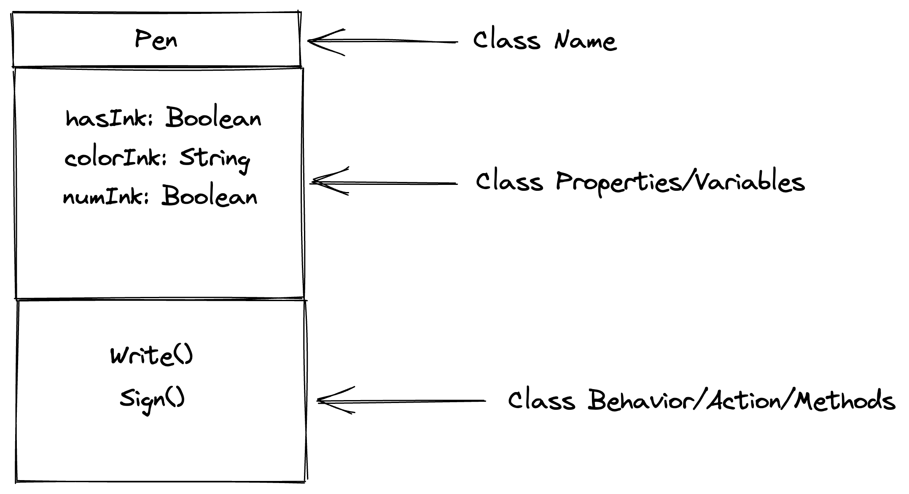
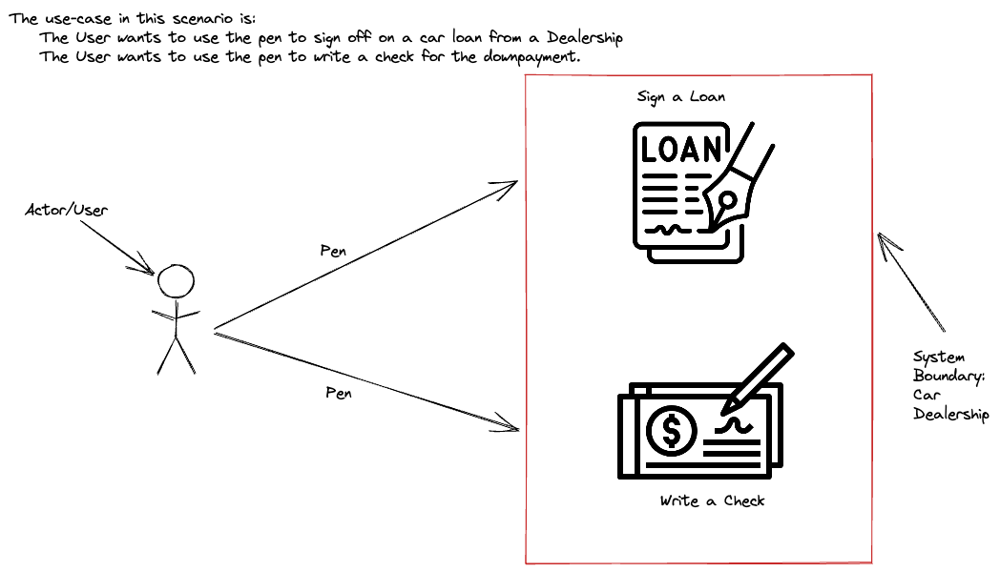
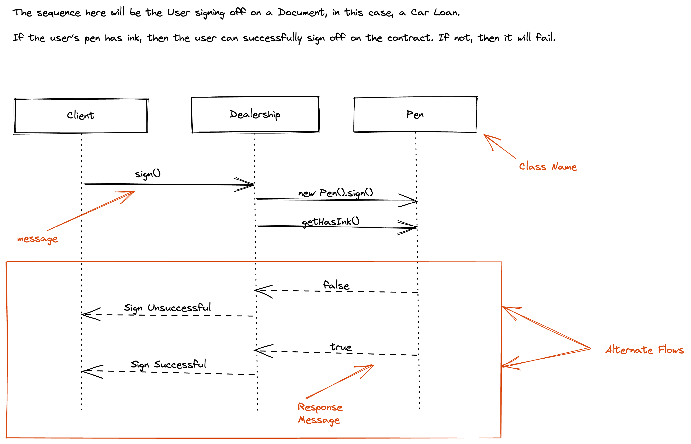

## Slides
Slides for the Day: [Demo Slides](https://docs.google.com/presentation/d/e/2PACX-1vQvtPZCjbh_UFL5SgKlDNpZCNZyp-lpdWcdyMvkGyxia4F-SA_Y7Ni9XcBonXYmnCDZCttr5DlQu-vk/pub?start=false&loop=false&delayms=3000).

## UML Tool
Generate UML's Easy: [Excalidraw](https://excalidraw.com/)

## Class Diagram for Pen Object

## Use Case Diagram for Pen Object

## Sequence Diagram for Pen Object
