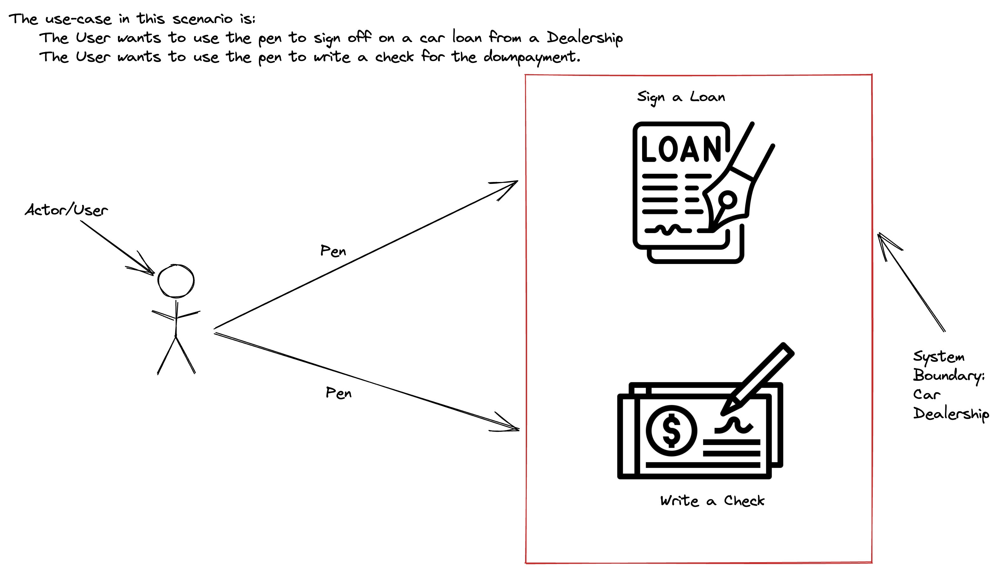

## Slides
Slides for the Day: [Demo Slides](https://docs.google.com/presentation/d/e/2PACX-1vQvtPZCjbh_UFL5SgKlDNpZCNZyp-lpdWcdyMvkGyxia4F-SA_Y7Ni9XcBonXYmnCDZCttr5DlQu-vk/pub?start=false&loop=false&delayms=3000).

## Class Diagram Example
<!-- Use Case for a Pen Object: [Pen Class Diagram](Pen-Class-Diagram.png) -->

## Use Case Diagram Example

## Sequence Diagram Example

